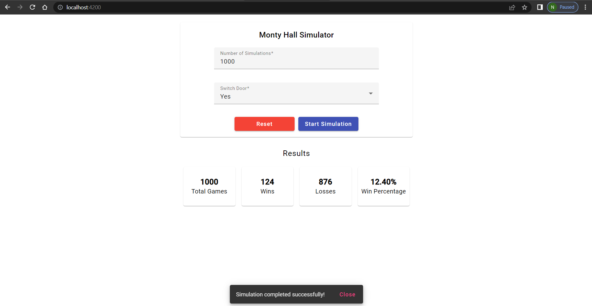

# Monty Hall Problem Simulator- Frontend

## Application Heading
Monty Hall Problem Simulator

## Application Description
The Monty Hall Problem Simulator frontend is built using Angular. This application simulates the Monty Hall problem, a famous probability puzzle based on a game show scenario. The simulator allows users to specify the number of simulations and whether to switch doors, then displays the results including total games, wins, losses, and win percentage.

## App Scenario


## How to Run the App
To run the application, follow these steps:

1. **Clone the Repository:**
   ```bash
   git clone <repository-url>
   cd monty_hall_frontend_angular

2. **Install Dependencies:**
    ```bash
    npm install

3. **Run the Application:**
    ```bash
    ng serve

## App Output
